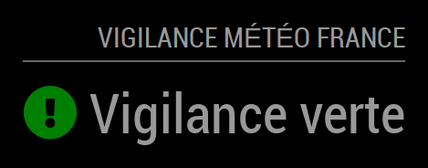
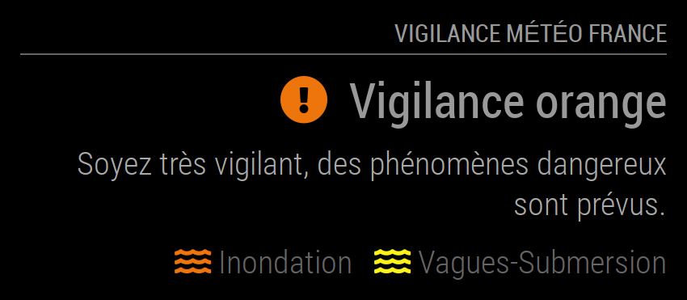
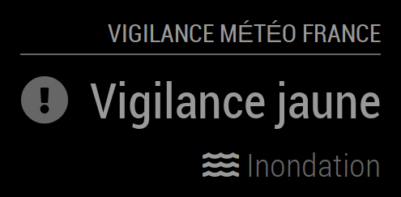

# Module: MMM-VigilanceMeteoFrance
This module displays the current level of vigilance of weather phenomena set by Météo France for each department of metropolitan france, including description and the associated risks.

Description, Risk legend and Color Legend display may be enabled or disabled independently. The max-width of the description can be fixed. 

<p align="left">



</p>

[MagicMirror Project on Github](https://github.com/MichMich/MagicMirror) | [Vigilance on Météo France](http://www.vigilance.meteofrance.com/)

## Installation:

In your terminal, go to your MagicMirror's Module folder:
```shell
cd ~/MagicMirror/modules
```

Clone this repository:
```shell
git clone https://github.com/grenagit/MMM-VigilanceMeteoFrance
```

Go to your MMM-VigilanceMeteoFrance's Module folder:
```shell
cd ~/MagicMirror/modules/MMM-VigilanceMeteoFrance
```

Install dependencies:
```shell
npm install
```

Configure the module in your config.js file.

## Update:

In your terminal, go to your MMM-APOD's Module folder:
```shell
cd ~/MagicMirror/modules/MMM-VigilanceMeteoFrance
```

Incorporate changes from this repository:
```shell
git pull
```

## Configuration:

### Basic configuration

To use this module, add it to the modules array in the `config/config.js` file:
```javascript
modules: [
	{
		module: "MMM-VigilanceMeteoFrance",
		position: "top_left",
		config: {
			department: 75, // Department number
		}
	}
]
```

### Options

The following properties can be configured:


| Option                       | Description
| ---------------------------- | -----------
| `department`                 | The department number (metropolitan france only). <br><br>  This value is **REQUIRED**
| `updateInterval`             | How often does the content needs to be fetched? (Milliseconds) <br><br> **Possible values:** `1000` - `86400000` <br> **Default value:** `1 * 60 * 60 * 1000` (1 hour)
| `animationSpeed`             | Speed of the update animation. (Milliseconds) <br><br> **Possible values:**`0` - `5000` <br> **Default value:** `1000` (1 second)
| `maxTextWidth`              | Maximum width for desription display. If set to 0, there is no limit. (Pixels) <br><br> **Possible values:**`0` - `5000` <br> **Default value:** `0` (no limit)
| `showDescription`            | Show the description. <br><br> **Possible values:** `true` or `false` <br> **Default value:** `false`
| `showRiskLegend`             | Show the risk legend. <br><br> **Possible values:** `true` or `false` <br> **Default value:** `true`
| `useColorLegend`             | Use the colored icons. <br><br> **Possible values:** `true` or `false` <br> **Default value:** `true`
| `initialLoadDelay`           | The initial delay before loading. If you have multiple modules that use the same API key, you might want to delay one of the requests. (Milliseconds) <br><br> **Possible values:** `1000` - `5000` <br> **Default value:**  `0`
| `retryDelay`                 | The delay before retrying after a request failure. (Milliseconds) <br><br> **Possible values:** `1000` - `60000` <br> **Default value:**  `2500`
| `apiBase`                    | The Météo France API base URL. <br><br> **Default value:**  `'http://www.vigilance.weatherfrance.com/'`
| `vigiEndpoint`               | The Vigilance API endPoint. <br><br> **Default value:**  `'data/NXFR33_LFPW_.xml'`

### Todo

- [x] Manage risks at different levels in the same department.
- [ ] Display an notification at the start of the MagicMirror in case of vigilance level 2 to 4.
- [ ] Display an notification in case of new risk.

### License

This module is licensed under the MIT License
