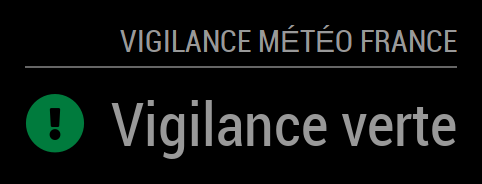

# Module: MMM-VigilanceMeteoFrance
This module displays the current level of vigilance of weather phenomena set by Météo France for each department of metropolitan france, including description and the associated risks. A notification is displayed in case of a change in the level of vigilance or new risks.

Description, Risk legend and Color Legend display may be enabled or disabled independently. The max-width of the description can be fixed. Notifications can be disabled.

<p align="left">



</p>

[MagicMirror Project on Github](https://github.com/MichMich/MagicMirror) | [Vigilance on Météo France](https://vigilance.meteofrance.fr) | [APIs on Météo France](https://portail-api.meteofrance.fr)

⚠️ **MMM-VigilanceMeteoFrance 2.2** (January 2024) uses the **simplified authentication system** from Météo France. A **single Application ID** is **now required** instead of **2 keys** for the module to work, please **update your conifguration**! [More info below](#appid)

## Installation:

In your terminal, go to your MagicMirror's Module folder:
```shell
cd ~/MagicMirror/modules
```

Clone this repository:
```shell
git clone https://github.com/grenagit/MMM-VigilanceMeteoFrance
```

Go to your MMM-VigilanceMeteoFrance's Module folder:
```shell
cd ~/MagicMirror/modules/MMM-VigilanceMeteoFrance
```

Install dependencies:
```shell
npm install
```

Configure the module in your config.js file.

## Update:

In your terminal, go to your MMM-VigilanceMeteoFrance's Module folder:
```shell
cd ~/MagicMirror/modules/MMM-VigilanceMeteoFrance
```

Incorporate changes from this repository:
```shell
git pull
```

Install dependencies:
```shell
npm install
```

## Configuration:

### Basic configuration

To use this module, add it to the modules array in the `config/config.js` file:
```javascript
modules: [
	{
		module: "MMM-VigilanceMeteoFrance",
		position: "top_left",
		config: {
			appid: "WkU5X0NvWDRKODJ2THE0OUw1b2FyVEN0OFdZYTpla3hQb1ZqMmRQaXJ3c0pYcnNzRUFZM1kxUnNh", // Météo France Application ID
			department: 75, // Department number
		}
	}
]
```

### <a name="appid"></a>Application ID

You can use this appid, but the limitation of 60 requests/minute is shared with all users: `WkU5X0NvWDRKODJ2THE0OUw1b2FyVEN0OFdZYTpla3hQb1ZqMmRQaXJ3c0pYcnNzRUFZM1kxUnNh`

It's therefore recommended to use your own appid! To obtain this, please follow these steps:
- [Log in](https://portail-api.meteofrance.fr/web/) or [create an account](https://portail-api.meteofrance.fr/web/) on the Météo France API portal
- [Subscribe](https://portail-api.meteofrance.fr/web/fr/api/DonneesPubliquesVigilance) to Vigilance API
- Go to `Générer Token` tab: User icon (top right) > `Mes API` > Choose an api > `Générer Token`
- Check that `OAuth2` is selected (default choice)
- Extract `YOUR_OWN_APP_ID` from curl's command: `curl -k -X POST https://portail-api.meteofrance.fr/token -d "grant_type=client_credentials" -H "Authorization: Basic YOUR_OWN_APP_ID"`

[Screenshot here](APIPortalMeteoFrance_appid.png) and [More info here](https://portail-api.meteofrance.fr/web/fr/faq)

### Options

The following properties can be configured:


| Option                       | Description
| ---------------------------- | -----------
| `appid`                      | The [Météo France](https://portail-api.meteofrance.fr) Application ID, which can be obtained by [following the steps above](#appid). It's free! <br><br>  This value is **REQUIRED**
| `department`                 | The department number (metropolitan france only). <br><br>  This value is **REQUIRED**
| `excludedRisks`              | The table of excluded risks (see below for the identifiers to be used).<br><br> **Use with caution (some risks that may be important will not be displayed)** <br> **Default value:** `[]` (any)
| `updateInterval`             | How often does the content needs to be fetched? (Milliseconds) <br><br> **Possible values:** `1000` - `86400000` <br> **Default value:** `1 * 60 * 60 * 1000` (1 hour)
| `animationSpeed`             | Speed of the update animation. (Milliseconds) <br><br> **Possible values:**`0` - `5000` <br> **Default value:** `1000` (1 second)
| `notificationDuration`       | Time to display notification. (Milliseconds) <br><br> **Possible values:**`1000` - `86400000` <br> **Default value:** `1 * 60 * 1000` (1 minute)
| `maxTextWidth`               | Maximum width for desription display. If set to 0, there is no limit. (Pixels) <br><br> **Possible values:**`0` - `5000` <br> **Default value:** `0` (no limit)
| `maxRisksInline`             | Maximum number of risks displayed on the same line. If set to 0, there is no limit. <br><br> **Possible values:**`0` - `9` <br> **Default value:** `3`
| `showDepartment`             | Show the department name. <br><br> **Possible values:** `true` or `false` <br> **Default value:** `false`
| `showDescription`            | Show the description. <br><br> **Possible values:** `true` or `false` <br> **Default value:** `false`
| `showRiskLegend`             | Show the risk legend. <br><br> **Possible values:** `true` or `false` <br> **Default value:** `true`
| `showForecast`               | Show the future level of vigilance. <br><br> **Possible values:** `true` or `false` <br> **Default value:** `false`
| `showNotification`           | Show notification (level of vigilance change or new risks). <br><br> **Possible values:** `true` or `false` <br> **Default value:** `true`
| `hideGreenLevel`             | Hide module when vigilance level is green. <br><br> **Possible values:** `true` or `false` <br> **Default value:** `false`
| `useColorLegend`             | Use the colored icons. <br><br> **Possible values:** `true` or `false` <br> **Default value:** `true`
| `initialLoadDelay`           | The initial delay before loading. If you have multiple modules that use the same API key, you might want to delay one of the requests. (Milliseconds) <br><br> **Possible values:** `1000` - `5000` <br> **Default value:**  `0`
| `oauthEndpoint`              | The Météo France Oauth2 endPoint. <br><br> **Default value:**  `'https://portail-api.meteofrance.fr/token'`
| `vigiEndpoint`               | The Vigilance API endPoint. <br><br> **Default value:**  `'https://public-api.meteofrance.fr/public/DPVigilance/v1/cartevigilance/encours'`
| `frenchDepartmentsTable`     | The conversion table to convert the department number to department name.

Identifants used for risks in `excludedRisks`:

| Id | Risk
| -- | ----
| 1  | Vent
| 2  | Pluie-Inondation
| 3  | Orages
| 4  | Inondation
| 5  | Neige
| 6  | Canicule
| 7  | Grand Froid
| 8  | Avalanches
| 9  | Vagues-Submersion

*For example:*
- If you don’t want to see avalanche risks : `excludedRisks: [8],`
- If you don’t want to see the risks of heat wave and extreme cold : `excludedRisks: [6, 7],`


### Integration with other modules

The following [notifications](https://github.com/MichMich/MagicMirror/wiki/notifications) can be used by other modules:

| Action                          | Notification                | Payload
| ------------------------------- | --------------------------- | -------
| Change the vigilance department | VIGI_METEOFRANCE_DEPARTMENT | The department number

For example, use `this.sendNotification("VIGI_METEOFRANCE_DEPARTMENT", 75);` if you want to change department number so that it corresponds to that of Paris (75).

## Todo:

- [x] Hide, if you want, the module when vigilance level is green.
- [x] Display, if you want, the department name.
- [x] Manage risks at different levels in the same department.
- [x] Display an notification at the start of the MagicMirror in case of vigilance level 2 to 4.
- [x] Display an notification in case of new risk.

## Testing:

To test the new features, you can use the testing branch:

- Change from master version to testing version: `git checkout testing`
- Return to master version from testing version: `git checkout master`
- Check the version used: `git branch -v`

## License:

This module is licensed under the MIT License
